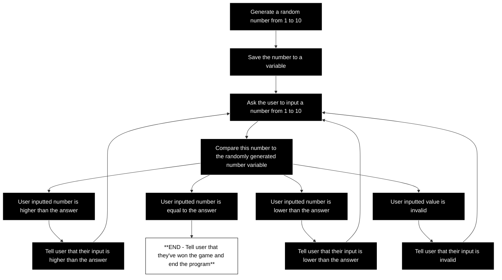

```mermaid
flowchart TD

A[Generate a random number from 1 to 10] --> B[Save the number to a variable] --> C[Ask the user to input a number from 1 to 10] --> D[Compare this number to the randomly generated number variable] 
D --> E[User inputted number is higher than the answer]
D --> F[User inputted number is equal to the answer]
D --> G[User inputted number is lower than the answer]
D --> H[User inputted value is invalid]
E --> I[Tell user that their input is higher than the answer]
I --> C
F --> J[**END - Tell user that they've won the game and end the program**]
G --> K[Tell user that their input is lower than the answer]
K --> C
H --> L[Tell user that their input is invalid]
L --> C

style A fill:#000, stroke:#fff, color: white
style B fill:#000, stroke:#fff, color: white
style C fill:#000, stroke:#fff, color: white
style D fill:#000, stroke:#fff, color: white
style E fill:#000, stroke:#fff, color: white
style F fill:#000, stroke:#fff, color: white
style G fill:#000, stroke:#fff, color: white
style H fill:#000, stroke:#fff, color: white
style I fill:#000, stroke:#fff, color: white
style J fill: white, stroke: black, color: black 
style K fill:#000, stroke:#fff, color: white
style L fill:#000, stroke:#fff, color: white
```